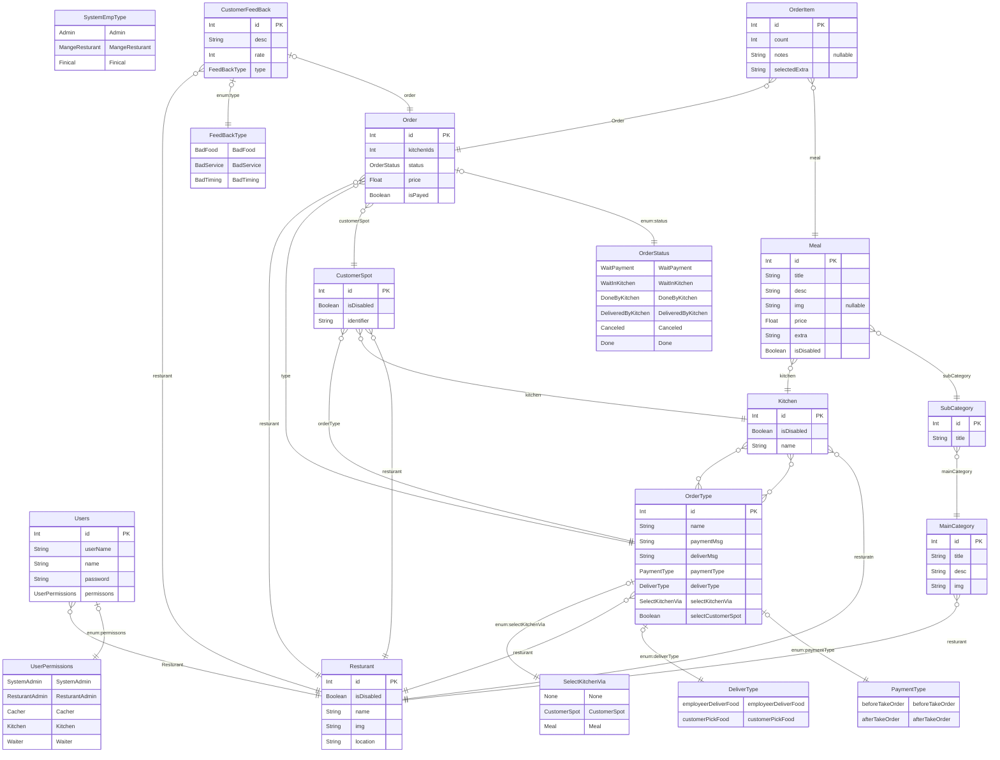

```mermaid
erDiagram

        SystemEmpType {
            Admin Admin
MangeResturant MangeResturant
Finical Finical
        }
    


        PaymentType {
            beforeTakeOrder beforeTakeOrder
afterTakeOrder afterTakeOrder
        }
    


        DeliverType {
            employeerDeliverFood employeerDeliverFood
customerPickFood customerPickFood
        }
    


        UserPermissions {
            SystemAdmin SystemAdmin
ResturantAdmin ResturantAdmin
Cacher Cacher
Kitchen Kitchen
Waiter Waiter
        }
    


        OrderStatus {
            WaitPayment WaitPayment
WaitInKitchen WaitInKitchen
DoneByKitchen DoneByKitchen
DeliveredByKitchen DeliveredByKitchen
Canceled Canceled
Done Done
        }
    


        FeedBackType {
            BadFood BadFood
BadService BadService
BadTiming BadTiming
        }
    


        SelectKitchenVia {
            None None
CustomerSpot CustomerSpot
Meal Meal
        }
    
  Users {
    Int id PK 
    String userName  
    String name  
    String password  
    UserPermissions permissons  
    }
  

  Resturant {
    Int id PK 
    Boolean isDisabled  
    String name  
    String img  
    String location  
    }
  

  Kitchen {
    Int id PK 
    Boolean isDisabled  
    String name  
    }
  

  CustomerSpot {
    Int id PK 
    Boolean isDisabled  
    String identifier  
    }
  

  MainCategory {
    Int id PK 
    String title  
    String desc  
    String img  
    }
  

  SubCategory {
    Int id PK 
    String title  
    }
  

  Meal {
    Int id PK 
    String title  
    String desc  
    String img  "nullable"
    Float price  
    String extra  
    Boolean isDisabled  
    }
  

  OrderItem {
    Int id PK 
    Int count  
    String notes  "nullable"
    String selectedExtra  
    }
  

  OrderType {
    Int id PK 
    String name  
    String paymentMsg  
    String deliverMsg  
    PaymentType paymentType  
    DeliverType deliverType  
    SelectKitchenVia selectKitchenVia  
    Boolean selectCustomerSpot  
    }
  

  Order {
    Int id PK 
    Int kitchenIds  
    OrderStatus status  
    Float price  
    Boolean isPayed  
    }
  

  CustomerFeedBack {
    Int id PK 
    String desc  
    Int rate  
    FeedBackType type  
    }
  
    Users o|--|| UserPermissions : "enum:permissons"
    Users o{--|| Resturant : "Resturant"
    Kitchen o{--|| Resturant : "resturatn"
    Kitchen o{--}o OrderType : ""
    CustomerSpot o{--|| Resturant : "resturant"
    CustomerSpot o{--|| Kitchen : "kitchen"
    CustomerSpot o{--|| OrderType : "orderType"
    MainCategory o{--|| Resturant : "resturant"
    SubCategory o{--|| MainCategory : "mainCategory"
    Meal o{--|| SubCategory : "subCategory"
    Meal o{--|| Kitchen : "kitchen"
    OrderItem o{--|| Meal : "meal"
    OrderItem o{--|| Order : "Order"
    OrderType o|--|| PaymentType : "enum:paymentType"
    OrderType o|--|| DeliverType : "enum:deliverType"
    OrderType o{--|| Resturant : "resturant"
    OrderType o|--|| SelectKitchenVia : "enum:selectKitchenVia"
    OrderType o{--}o Kitchen : ""
    Order o|--|| OrderStatus : "enum:status"
    Order o{--|| CustomerSpot : "customerSpot"
    Order o{--|| OrderType : "type"
    Order o{--|| Resturant : "resturant"
    CustomerFeedBack o|--|| Order : "order"
    CustomerFeedBack o|--|| FeedBackType : "enum:type"
    CustomerFeedBack o{--|| Resturant : "resturant"
```
